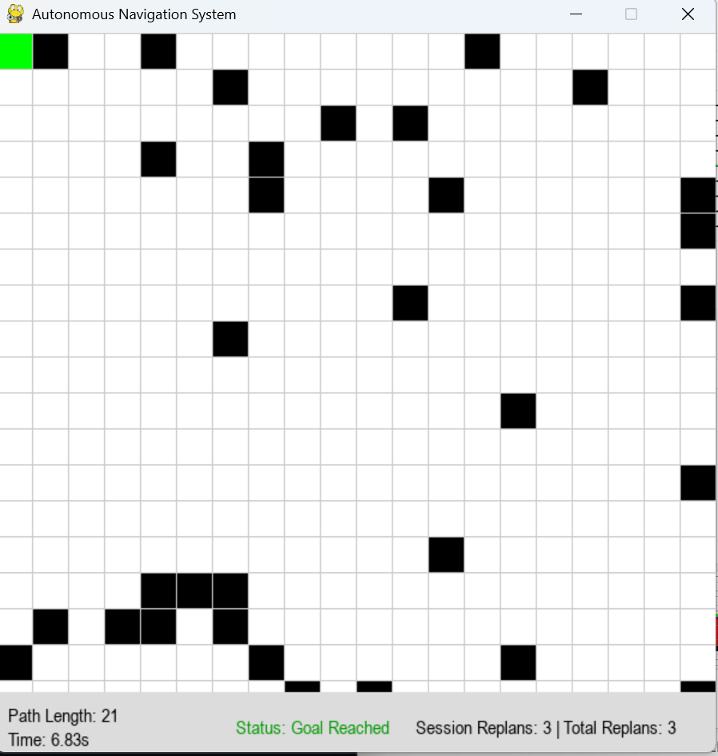
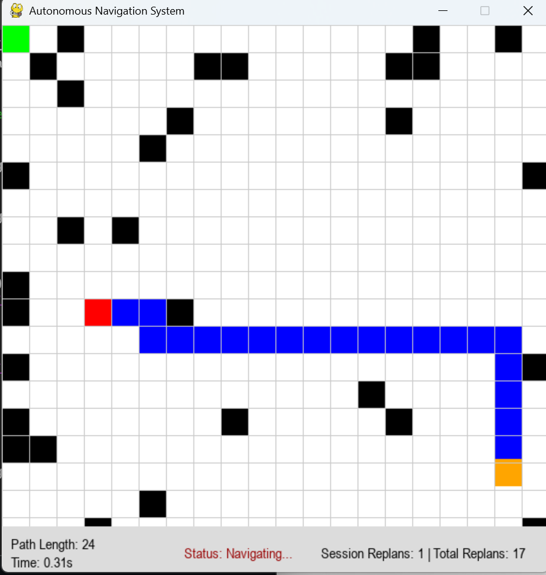
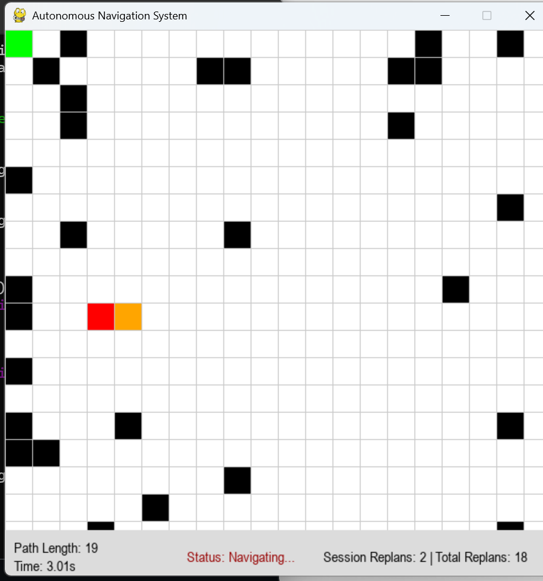
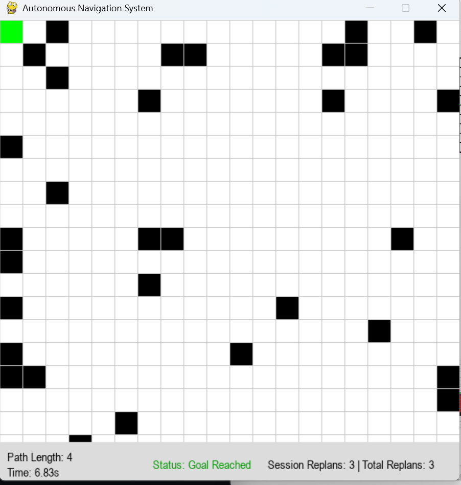
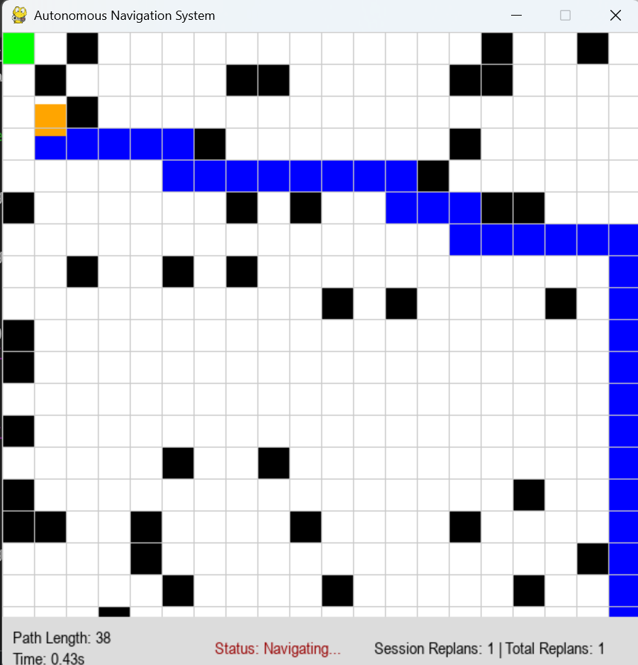

# 🚗 AI-Based Autonomous Navigation System

## 📌 Overview

An AI-powered simulation of an autonomous agent navigating a dynamic grid environment using the A* path planning algorithm.

The system performs **real-time path replanning** in response to obstacles and continuously updates navigation decisions while tracking performance metrics.

---

## 🎯 Key Features

* Real-time A* path planning
* Dynamic obstacle handling & replanning
* Smooth agent movement simulation
* Click-to-set goal interaction
* Performance tracking:

  * Path Length
  * Execution Time
  * Session & Total Replans
* Clean grid-based visualization using Pygame

---

## 🧠 System Workflow

1. Generate grid-based environment
2. Place static and dynamic obstacles
3. Compute optimal path using A*
4. Monitor environment continuously
5. Trigger replanning when path is blocked
6. Execute navigation to goal

---

## 📸 Results

### 🧱 Initial Environment



### 🧠 Path Planning (A*)



### 🔄 Dynamic Navigation & Replanning



### ✅ Goal Reached



### 🚀 Complex Scenario



---

## 🛠️ Tech Stack

* Python
* Pygame
* NumPy
* A* Algorithm

---

## ⚙️ Installation

```bash
pip install -r requirements.txt
python main.py
```

---

## 🎮 Usage

* Run the simulation
* Click anywhere to set a goal
* Observe real-time navigation and replanning

---

## 📊 Output Insights

* Efficient path optimization using A*
* Adaptive navigation in dynamic environments
* Real-time performance monitoring

---

## 🚀 Future Improvements

* YOLO-based real-world obstacle detection
* Integration with CARLA simulator
* Reinforcement Learning-based navigation
* Multi-agent path coordination

---

## 👨‍💻 Author

Varda Kunde
